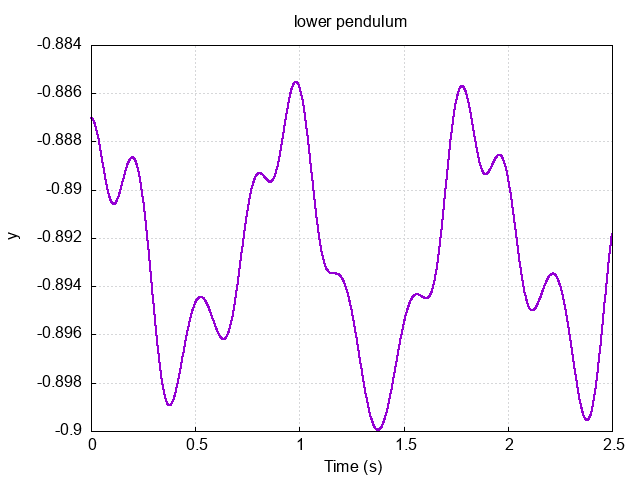

# double_pendulum

Simulating the chaotic motion of the double-pendulum system.


# Building

Use [fpm](https://github.com/fortran-lang/fpm) to build and run the project. 

``` 
fpm build 
fpm run

```
Plotting is done using the [ogpf](https://github.com/kookma/ogpf) library


